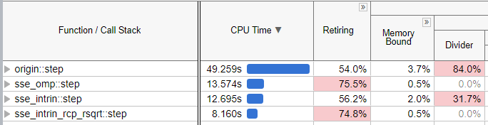
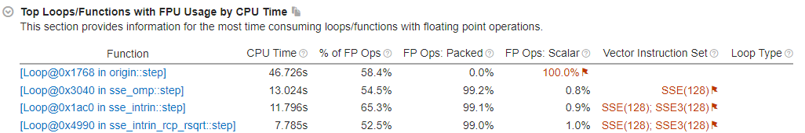

# Intrinsic优化

## 项目简介

通过使用处理器内置函数（intrinsic）对天体系统能量计算方法进行了优化。其中，利用Intel VTune Amplifier进行了热点分析和微架构分析，进一步提升了算法的执行效率。

## 环境要求

- C++编译器（支持C++11标准）
- Linux环境工具链（建议使用WSL与VsCode进行编程）

## 具体实现

- **SSE与OpenMP版本 (`sse_omp.h`)**：通过分离`x`、`y`、`z`的计算并利用OpenMP实现并行计算，提高了程序的执行效率。

- **完全使用Intrinsic的版本(`sse_intrin.h`)**：深入底层，直接调用处理器内置函数，绕过高级语言的性能开销，进一步优化数据处理。

- **使用快速倒数和开方指令优化 (`sse_intrin_rcp_rsqrt.h`)**：在针对性能瓶颈进行Intel VTune分析后，我们发现除法运算成为了主要的限制因素，导致指令执行的效率降低（大部分指令都在等待除法的结果）。为了解决这一问题，我们引入了快速倒数（rcp）和快速开方（rsqrt）指令，以替代传统的除法和开方运算。这一改进显著提升了程序的性能，有效地减少了由除法运算导致的执行阻塞，从而使得指令的执行更加流畅，提高了程序的整体运行效率。

## 结果
使用Intel VTune进行分析的结果：
Microarchitecture Exploration：

HPC Performance Characterization
